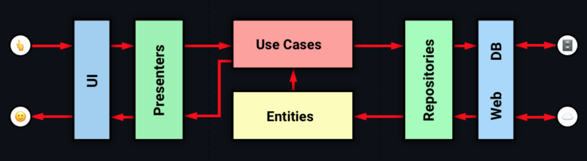

# OrbitMvi-Approach (An Android Redux implementations)

The goal of the test is to create an app that shows information about countries around the world using [REST-Country](https://restcountries.com/)
The app has to display a list of countries with their flags, you can open the detail screen by
selecting a country.

## Project specifications

Project features:

* 100% [Kotlin](https://kotlinlang.org/)
* [Android Jetpack libraries](https://developer.android.com/jetpack) (ViewModel, Lifecycle, Navigation)
* Clean architecture ([wiki](https://www.geeksforgeeks.org/what-is-clean-architecture-in-android))
* Multi-modular approach ([wiki](https://developer.android.com/topic/modularization))
* Single activity (with [Navigation component](https://developer.android.com/guide/navigation/navigation-getting-started) to navigate between fragments)
* MVI presentation pattern (AKA unidirectional data flow)
* Coroutines
* Dependency injection
* Unit and instrumentation (UI) tests

## Tech stack



Libraries used in the app:

* Google + JetBrains
    * [Kotlin](https://kotlinlang.org/)
    * [Coroutines](https://kotlinlang.org/docs/reference/coroutines-overview.html)
    * [Jetpack](https://developer.android.com/jetpack)
        * [Lifecycle](https://developer.android.com/topic/libraries/architecture/lifecycle)
        * [ViewModel](https://developer.android.com/topic/libraries/architecture/viewmodel)
        * [Navigation](https://developer.android.com/topic/libraries/architecture/navigation/)
* Dependency injection
    * [Koin](https://insert-koin.io/)
* Network + Image
    * [Retrofit](https://square.github.io/retrofit/)
    * [Coil](https://github.com/coil-kt/coil)
* Tests
    * [Unit Tests](https://en.wikipedia.org/wiki/Unit_testing) ([JUnit4](https://junit.org/junit4/))
    * [Mockk](https://mockk.io/)
    * [Espresso](https://developer.android.com/training/testing/espresso/)
    * [Kakao](https://github.com/agoda-com/Kakao)
* Gradle
    * [Gradle Kotlin DSL](https://docs.gradle.org/current/userguide/kotlin_dsl.html)
* Static analysis tools
    * [ktlint](https://ktlint.github.io/)
    * [detekt](https://arturbosch.github.io/detekt/)
* Continuous integration
    * [Github Actions](https://github.com/features/actions)
    

### Compile the app
To build the app, just use the following gradle command:

```
./gradlew assembleDebug
```

## Running tests

### UI tests

* [CountryList](/feature-country-list/src/androidTest/java/com/orbitmvi/feature/list/presentation/CountryListFragmentTest.kt) 
* [CountryDetail](/feature-country-details/src/androidTest/java/com/orbitmvi/feature/details/presentation/CountryDetailsFragmentTest.kt)

To run UI tests, execute the following gradle command:
```
./gradlew connectedDebugAndroidTest
```

View the report files in the path in
* [[UiTest]List Report](/feature-country-list/build/reports/androidTests/connected/index.html)
* [[UiTest]Detail Report](/feature-country-details/build/reports/androidTests/connected/index.html)


### Unit tests

To run unit tests, execute the following gradle command:

```
./gradlew test
```
View the report files in the path in
* [[UnitTest]List Report](/feature-country-list/build/reports/tests)
* [[UnitTest]Detail Report](/feature-country-details/build/reports/tests)

## Code analysis

### Detekt

To run code performance test:

```
./gradlew detekt
```
View the report files in the path in
* [[Detekt]List Report](/feature-country-list/build/reports/detekt/detekt.html)
* [[Detekt]Detail Report](/feature-country-details/build/reports/detekt/detekt.html)

### ktlin

To run code cleaning test:

```
./gradlew ktlin
```


## Author

[Antonio Passaro - Android Engineer](mailto:tonyno92@gmail.com)
